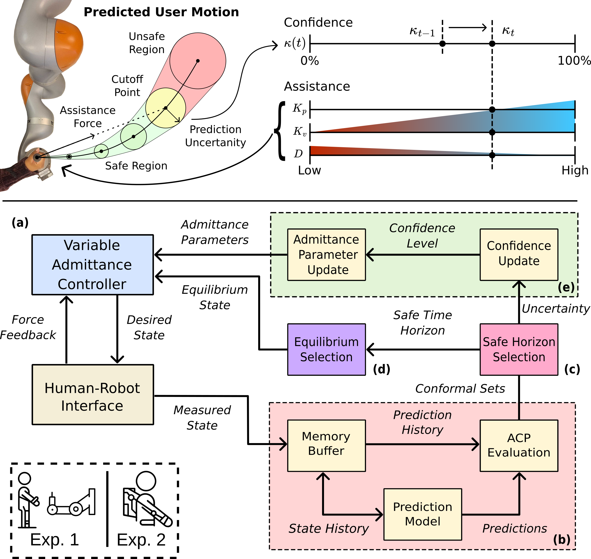

# Conformal Variable-Horizon and Confidence-Aware Variable Admittance Control for Physical Human-Robot Interaction

This repository contains two separate ROS-based experiment packages used to generate the results for the paper Conformal Variable-Horizon and Confidence-Aware Variable Admittance Control for Physical Human-Robot Interaction:

- `guided_target_reaching_task/`: A ROS1 Melodic package for guided target-reaching experiments.
- `anticipatory_exoskeleton_gravity_compensation/`: A ROS1 Noetic workspace for anticipatory exoskeleton gravity compensation experiments.

For full details, usage, and package-specific dependencies, see the README in each subfolder:

- `guided_target_reaching_task/README.md`
- `anticipatory_exoskeleton_gravity_compensation/README.md`

## Authors
- Code: John Atkins and Seunghoon Hwang
- Paper: John Atkins, Seunghoon Hwang, Wanxin Jin, and Hyunglae Lee
- Thanks To: Divya Prakash, Dongjune Chang

## Contact
Contact John Atkins for any issues with the underlying code.